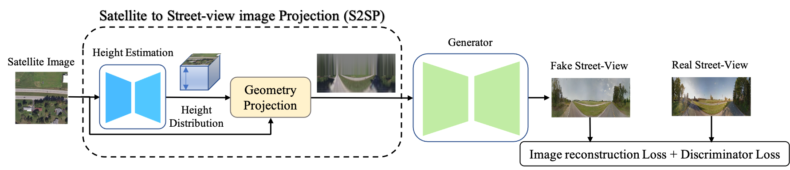

# Sat2StrPanoramaSynthesis
Geometry-Guided Street-View Panorama Synthesis from Satellite Imagery, TPAMI 2022

# Abstract
This paper presents a new approach for synthesizing a novel street-view panorama given a satellite image, as if captured from the geographical location at the center of the satellite image. Existing works approach this as an image generation problem, adopting generative adversarial networks to implicitly learn the cross-view transformations, but ignore the geometric constraints.
In this paper, we make the geometric correspondences between the satellite and street-view images explicit so as to facilitate the transfer of information between domains.
Specifically, we observe that when a 3D point is visible in both views, and the height of the point relative to the camera is known, there is a deterministic mapping between the projected points in the images.
Motivated by this, we develop a novel satellite to street-view projection (S2SP) module which learns the height map and projects the satellite image to the ground-level viewpoint, explicitly connecting corresponding pixels.
With these projected satellite images as input, we next employ a generator to synthesize realistic street-view panoramas that are geometrically consistent with the satellite images.
Our S2SP module is differentiable and the whole framework is trained in an end-to-end manner.
Extensive experimental results on two cross-view benchmark datasets demonstrate that our method generates more accurate and consistent images than existing approaches.

### Experiment Dataset

Our experiment is conducted on the CVUSA and CVACT dataset. For our processed data, please download [here](https://anu365-my.sharepoint.com/:f:/g/personal/u6293587_anu_edu_au/EuOBUDUQNClJvCpQ8bD1hnoBjdRBWxsHOVp946YVahiMGg?e=F4yRAC).  

### Codes

#### Training

cd script3

CUDA_VISIBLE_DEVICES=0 python main.py --dataset CVUSA --l1_weight_grd 0 --perceptual_weight_grd 1 --skip 0 --heightPlaneNum 64 --mode train

CUDA_VISIBLE_DEVICES=0 python main.py --dataset CVACT --l1_weight_grd 0 --perceptual_weight_grd 1 --skip 0 --heightPlaneNum 64 --mode train

#### Testing

cd script3

CUDA_VISIBLE_DEVICES=0 python main.py --dataset CVUSA --l1_weight_grd 0 --perceptual_weight_grd 1 --skip 0 --heightPlaneNum 64 --mode test 

CUDA_VISIBLE_DEVICES=0 python main.py --dataset CVACT --l1_weight_grd 0 --perceptual_weight_grd 1 --skip 0 --heightPlaneNum 64 --mode test 

### Publications
This work is published in TPAMI 2022.  
[Geometry-Guided Street-View Panorama Synthesis from Satellite Imagery]

If you are interested in our work and use our code, we are pleased that you can cite the following publication:  
*Yujiao Shi, and Hongdong Li. Geometry-Guided Street-View Panorama Synthesis from Satellite Imagery.*

@inproceedings{shi2020where,
  title={Geometry-Guided Street-View Panorama Synthesis from Satellite Imagery},
  author={Shi, Yujiao and Campbell, Dylan and Yu, Xin and Li, Hongdong},
  booktitle={TPAMI},
  year={2022}
}

